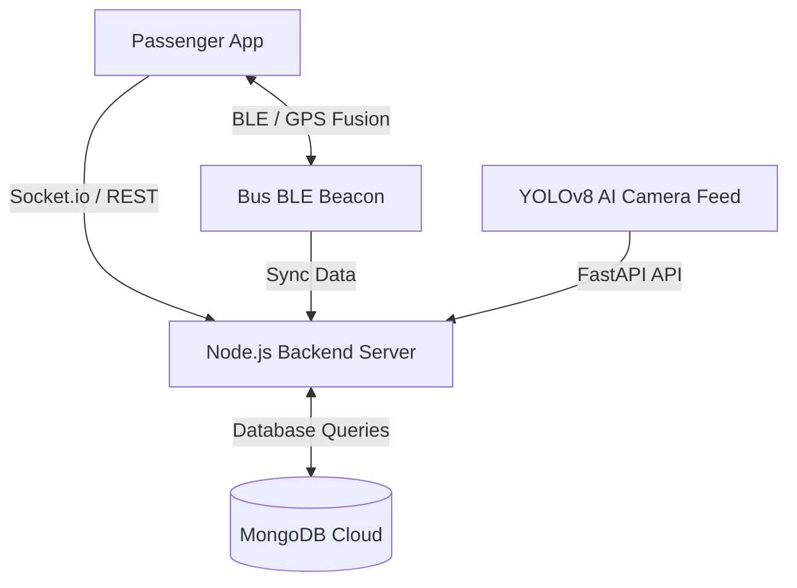

# 🚌 TapZigo - Smart Public Transport & Automated Fare Collection System

**TapZigo** is a modern, IoT and AI-powered mobile solution designed to revolutionize public transportation in Sri Lanka. It eliminates traditional physical tickets and manual cash transactions by offering a seamless, dynamic, and automated fare collection system for both passengers and bus conductors.

---

## 🚀 Key Features

### 👨‍✈️ Conductor & Inspection System
* **2D Visual Seat Grid Animation:** Real-time spatial mapping of seats showing paid passengers (🟢) vs unpaid fare evaders (🔴) using YOLOv8 AI.
* **Manual QR Pass Scanner:** Allows onboard checking and manual fare collection for non-smartphone users and children (Half-Tickets).
* **Instant Over-Travel Alerts:** Live notification when a passenger travels beyond their paid destination.

### 📱 Passenger Application
* **Seamless BLE & Geo-Fencing Check-In/Out:** Automatic journey detection via Bluetooth Low Energy (BLE) Beacons & GPS speed fusion without scanning codes.
* **In-App Digital Wallet:** Cashless top-ups integrated via payment gateways.
* **Live Bus Tracking:** Real-time map view showing active buses, routes, and estimated arrival times (ETA).
* **Advanced Seat Booking:** Pre-reservation system for luxury and long-distance intercity buses.
* **Offline-First Encrypted QR Pass:** Cryptographically signed QR codes saved in local storage (Hive DB) to ensure uninterrupted service in low-network regions.

---

## 🛠️ Technology Stack

| Layer | Technology Used |
| :--- | :--- |
| **Mobile Apps** | Flutter (Dart) - iOS & Android |
| **Backend API** | Node.js, Express.js |
| **Real-Time Communication** | Socket.io (WebSockets) |
| **Databases** | MongoDB Atlas (Primary), Redis (Coordinates Cache), Hive (Local App DB) |
| **AI / Object Detection** | Python, FastAPI, YOLOv8 (Ultralytics) |
| **Hardware Components** | BLE Beacons, Android IP Camera Feed |

---

## 🏛️ System Architecture

---

## 📸 Screenshots & UI Design
*Design prototypes and UI flows built with Figma.*

---

## 👤 Author

* **Oshadha**
* Higher National Diploma (HND) in Software Engineering
* NIBM, Sri Lanka

  
